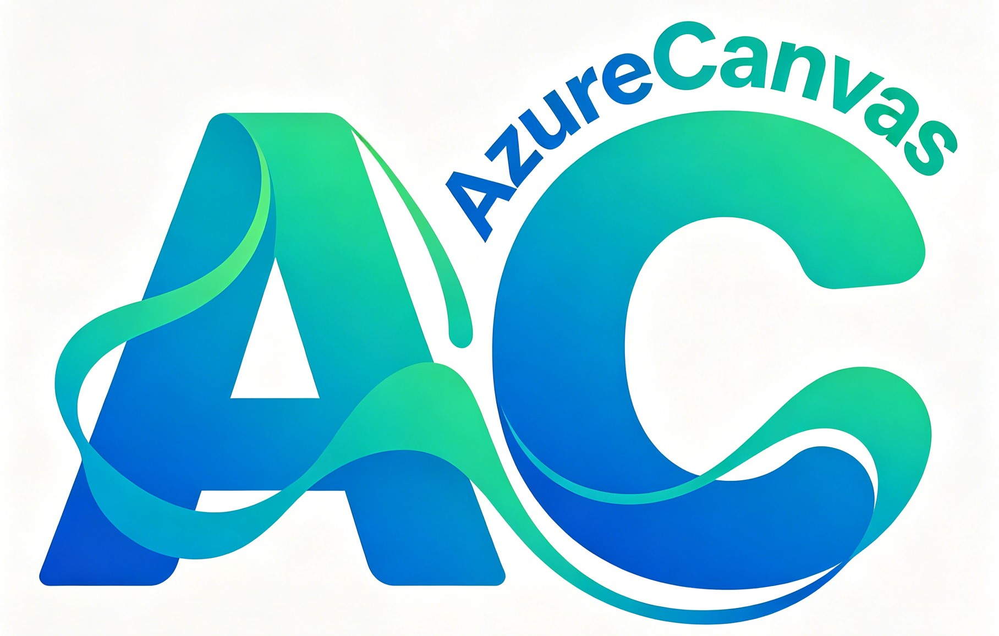

# AzureCanvas
AzureCanvas is a modern, playful, exquisite idea sharing forum website, which is built with native CSS, HTML and Javascript.
<p align="center">
   
   
    
</p>
<div align="center">
✨ AzureCanvas is a modern, playful, exquisite idea sharing forum website, which is built with native CSS, HTML and Javascript. ✨
    <br>
    <a href="https://www.oracle.com/java/technologies/downloads/">
        
    </a>
    <a href="">
      
    </a>
    <a href="">
      
    </a>
    <a href="">
      
    </a>
<a href="">
      
    </a>
  <a href="">
      
    </a>
    <a href="">
      
    </a>
    <a href="">
      
    </a>
    <a href="">
        
    </a>
    <a href="">
        
    </a>
    <br>
    
</div>


## Features
**Implemented Features:**
- `Aero Effect`
- `Immersive 3D UI/UX`
- `Tailwind.css Styles`
- `Glass-Mophor & Liquid Glass Effect`
- `GSAP & Three.js`
- `GLSL Shader Empowered`
- `3D Interactions`
- `Interactive Designs`
- `Native CSS Scroll Animation`
- `JavaScript Animation`
- `Canvas Rendered Vision Effect`.

## Functionality
* `Azure 3D Skyland Landscape`
* `Azure 3D Futuristic Cube`
* `Azure 3D Login Tunnel`
* `Treehole`
  * `Treehole Pet`
* `Azure Story Map`
* `Azure Trade Marketplace`
* `AzureCanvas About Page`


## APIs

### AuthController - 认证管理 (`/api/auth`)

| HTTP Method | Route | Description | Request Body (Example) | Response Body (Example) |
|:-----------:|------:|------------:|----------------------:|------------------------:|
| `POST` | `/api/auth/register` | 用户注册 | `{ "username": "john_doe", "email": "john@example.com", "password": "password123" }` | `{ "success": true, "message": "Register Successfully!", "user": { ... } }` |
| `POST` | `/api/auth/login` | 用户登录（支持用户名/邮箱/手机号） | `{ "username": "john_doe", "password": "password123" }` | `{ "success": true, "user": { "token": "jwt-token", "user": { ... } } }` |
| `POST` | `/api/auth/logout` | 用户登出 | N/A | `{ "success": true, "message": "成功退出登录" }` |

### UsersController - 用户管理 (`/api/users`)

| HTTP Method | Route | Description | Request Body (Example) | Response Body (Example) |
|:-----------:|------:|------------:|----------------------:|------------------------:|
| `GET` | `/api/users/me` | 获取当前登录用户的信息（Cookie: user_id） | N/A | `{ "userId": "uuid", "username": "john_doe", "email": "...", "avatarUrl": "...", ... }` |
| `PUT` | `/api/users/me` | 更新当前登录用户的信息 | `{ "email": "new@email.com", "avatar": "http://...", "bio": "Updated bio" }` | `{ "id": "uuid", "username": "john_doe", "email": "...", "avatar": "...", ... }` |
| `GET` | `/api/users/{uuid}` | 获取指定用户的信息 | N/A | `{ "userId": "uuid", "username": "john_doe", "email": "...", ... }` |
| `GET` | `/api/users/me/posts` | 获取当前登录用户发布的所有帖子 | `?type=forum&page=1&limit=10` | `[ { "postId": "uuid", "title": "My first post", "createdAt": "timestamp", "type": "forum" }, ... ]` |
| `GET` | `/api/users/{userId}/followers` | 获取指定用户的关注者列表 | N/A | `[ { "userId": "uuid", "username": "follower1", "avatarUrl": "..." }, ... ]` |
| `GET` | `/api/users/{userId}/following` | 获取指定用户关注的人列表 | N/A | `[ { "userId": "uuid", "username": "following1", "avatarUrl": "..." }, ... ]` |
| `POST` | `/api/users/{userId}/follow` | 关注指定用户 | N/A | `{ "success": true, "message": "成功关注用户" }` |
| `DELETE` | `/api/users/{userId}/follow` | 取消关注指定用户 | N/A | `{ "success": true, "message": "成功取消关注用户" }` |

### PostController - 帖子管理 (`/api/posts`)

| HTTP Method | Route | Description | Request Body (Example) | Response Body (Example) |
|:-----------:|------:|------------:|----------------------:|------------------------:|
| `GET` | `/api/posts` | 获取所有帖子 | N/A | `[ { "id": 1, "title": "...", "content": "...", ... }, ... ]` |
| `GET` | `/api/posts/section/{sectionId}` | 获取指定版块的帖子 | N/A | `[ { "id": 1, "title": "...", "sectionId": "uuid", ... }, ... ]` |
| `GET` | `/api/posts/{id}` | 获取帖子详情（自动增加浏览量） | N/A | `{ "id": 1, "title": "...", "content": "...", "viewCount": 100, ... }` |
| `POST` | `/api/posts` | 创建新帖子 | `{ "title": "Post Title", "content": "Post content", "sectionId": "uuid" }` | `{ "id": 1, "title": "...", "content": "...", ... }` |
| `PUT` | `/api/posts/{id}` | 更新帖子 | `{ "title": "Updated Title", "content": "Updated content" }` | `{ "id": 1, "title": "...", "content": "...", ... }` |
| `DELETE` | `/api/posts/{id}` | 删除帖子 | N/A | `200 OK` |

### ReplyController - 回复管理 (`/api/replies`)

| HTTP Method | Route | Description | Request Body (Example) | Response Body (Example) |
|:-----------:|------:|------------:|----------------------:|------------------------:|
| `GET` | `/api/replies/post/{postId}` | 获取指定帖子的所有回复 | N/A | `[ { "id": 1, "content": "...", "postId": 1, ... }, ... ]` |
| `GET` | `/api/replies/parent/{parentId}` | 获取指定回复的子回复 | N/A | `[ { "id": 2, "content": "...", "parentId": 1, ... }, ... ]` |
| `POST` | `/api/replies` | 创建新回复 | `{ "content": "Reply content", "postId": 1, "parentId": null }` | `{ "id": 1, "content": "...", "postId": 1, ... }` |
| `PUT` | `/api/replies/{id}` | 更新回复 | `{ "content": "Updated reply content" }` | `{ "id": 1, "content": "...", ... }` |
| `DELETE` | `/api/replies/{id}` | 删除回复 | N/A | `200 OK` |

### SectionController - 版块管理 (`/api/sections`)

| HTTP Method | Route | Description | Request Body (Example) | Response Body (Example) |
|:-----------:|------:|------------:|----------------------:|------------------------:|
| `GET` | `/api/sections` | 获取所有版块 | N/A | `[ { "id": "uuid", "name": "技术讨论", "description": "...", ... }, ... ]` |
| `GET` | `/api/sections/{id}` | 获取版块详情 | N/A | `{ "data": { "id": "uuid", "name": "...", ... } }` |
| `POST` | `/api/sections` | 创建新版块 | `{ "name": "新版块", "description": "版块描述" }` | `{ "id": "uuid", "name": "...", ... }` |
| `PUT` | `/api/sections/{id}` | 更新版块 | `{ "name": "Updated Name", "description": "Updated desc" }` | `{ "id": "uuid", "name": "...", ... }` |
| `DELETE` | `/api/sections/{id}` | 删除版块 | N/A | `200 OK` |

### TreeholeController - 树洞管理 (`/api/treeholes`)

| HTTP Method | Route | Description | Request Body (Example) | Response Body (Example) |
|:-----------:|------:|------------:|----------------------:|------------------------:|
| `GET` | `/api/treeholes/posts` | 获取所有树洞帖子 | N/A | `[ { "id": 1, "content": "...", "author": "...", "imagesList": [...], ... }, ... ]` |
| `GET` | `/api/treeholes/posts/recent` | 获取最新树洞帖子 | `?limit=20` | `[ { "id": 1, "content": "...", ... }, ... ]` |
| `GET` | `/api/treeholes/newest` | 获取各模块最新内容（市场、树洞、故事地图） | N/A | `{ "items": [...], "treehole": {...}, "storymap": {...} }` |
| `GET` | `/api/treeholes/posts/{id}` | 获取树洞帖子详情（含评论树） | N/A | `{ "id": 1, "content": "...", "comments": [{...}, children: [...]], ... }` |
| `POST` | `/api/treeholes/posts` | 创建树洞帖子 | `{ "content": "匿名秘密", "title": "标题", "category": "分类", "images": ["url1","url2"], "isAnonymous": true }` | `{ "id": 1, "content": "...", ... }` |
| `DELETE` | `/api/treeholes/posts/{id}` | 删除树洞帖子 | N/A | `200 OK` |
| `POST` | `/api/treeholes/posts/{id}/like` | 点赞树洞帖子 | N/A | `200 OK` |
| `POST` | `/api/treeholes/posts/{id}/unlike` | 取消点赞树洞帖子 | N/A | `200 OK` |
| `GET` | `/api/treeholes/posts/{postId}/comments` | 获取树洞帖子的评论列表 | N/A | `[ { "id": 1, "content": "...", ... }, ... ]` |
| `POST` | `/api/treeholes/posts/{postId}/comments` | 创建树洞评论 | `{ "content": "评论内容", "parentId": null, "isAnonymous": false }` | `{ "id": 1, "content": "...", ... }` |
| `DELETE` | `/api/treeholes/comments/{id}` | 删除树洞评论 | N/A | `200 OK` |
| `GET` | `/api/treeholes/search` | 搜索树洞帖子（Elasticsearch） | `?keyword=关键词&category=all` | `[ { "id": 1, "content": "高亮内容...", "author": "...", ... }, ... ]` |

### MarketController - 市场交易 (`/api/market`)

| HTTP Method | Route | Description | Request Body (Example) | Response Body (Example) |
|:-----------:|------:|------------:|----------------------:|------------------------:|
| `GET` | `/api/market/search/es` | Elasticsearch搜索商品 | `?keyword=手机&page=1&limit=10` | `[ { "itemId": "uuid", "title": "...", "highlightTitle": "<em>手机</em>...", ... }, ... ]` |
| `GET` | `/api/market/items` | 获取商品列表（支持筛选排序） | `?category=电子&sortBy=price&order=asc&page=1&limit=10&search=关键词` | `[ { "itemId": "uuid", "title": "...", "price": 100.00, ... }, ... ]` |
| `GET` | `/api/market/items/{itemId}` | 获取商品详情 | N/A | `{ "itemId": "uuid", "title": "...", "description": "...", "price": 100.00, "sellerUsername": "...", ... }` |
| `GET` | `/api/market/users/me/items` | 获取当前用户的商品列表 | `?status=active&page=1&limit=10` | `[ { "itemId": "uuid", "title": "...", ... }, ... ]` |
| `POST` | `/api/market/item/{itemId}/images` | 为商品添加图片 | `{ "images": ["uuid1", "uuid2"] }` | `{ "success": true }` |
| `POST` | `/api/market/items` | 发布新商品（Cookie: user_id） | `{ "title": "iPhone 15", "description": "99新", "price": "5999.00", "category": "电子产品" }` | `{ "itemId": "uuid-string" }` |
| `DELETE` | `/api/market/items/{itemId}` | 删除商品 | N/A | `{ "success": true, "message": "Item deleted successfully." }` |
| `POST` | `/api/market/items/favorite` | 收藏商品（Cookie: user_id） | `?itemId=uuid` | `{ }` |
| `GET` | `/api/market/items/favorites` | 获取收藏的商品列表（Cookie: user_id） | N/A | `[ { "itemId": "uuid", "title": "...", ... }, ... ]` |
| `GET` | `/api/market/categories` | 获取所有商品分类 | N/A | `[ { "categoryId": "uuid", "name": "电子产品" }, ... ]` |
| `POST` | `/api/market/{sellerId}/contact` | 联系卖家 | `{ "message": "感兴趣，还在吗？", "itemId": "uuid" }` | `{ "messageId": "uuid", "sentAt": "2024-01-01T..." }` |

### StoryMapController - 故事地图 (`/api/storymaps`)

| HTTP Method | Route | Description | Request Body (Example) | Response Body (Example) |
|:-----------:|------:|------------:|----------------------:|------------------------:|
| `GET` | `/api/storymaps` | 获取所有故事地图 | `?page=1&limit=10` | `[ { "storyMapId": "uuid", "title": "...", "description": "...", "locations": [...], "likes": 10, ... }, ... ]` |
| `GET` | `/api/storymaps/{id}` | 获取地图详情 | N/A | `{ "storyMapId": "uuid", "title": "...", "locations": [...], ... }` |
| `POST` | `/api/storymaps` | 创建故事地图 | `{ "title": "校门故事", "description": "...", "lat": 22.12, "lng": 113.12 }` | `{ "storyMapId": "uuid", ... }` |
| `PUT` | `/api/storymaps/{id}` | 更新地图信息 | `{ "title": "新标题", "description": "新描述" }` | `{ "storyMapId": "uuid", ... }` |
| `DELETE` | `/api/storymaps/{id}` | 删除故事地图 | N/A | `{ "success": true }` |
| `POST` | `/api/storymaps/{id}/like` | 点赞地图 | N/A | `{ "success": true }` |

## 数据库合并验证 (Combined Entity Refactoring)

### 1. 表结构合并
已将 `StoryMap` (基础信息)、`StoryMapLocation` (位置) 和 `StoryMapStats` (统计) 合并为 `story_map_combined` 单表。

### 2. 联合索引验证
针对高频查询字段 `location_code`, `status`, `likes_count` 建立了联合索引 `idx_location_code_status_likes`。

**EXPLAIN 验证示例:**
```sql
EXPLAIN SELECT * FROM story_map_combined 
WHERE location_code = 'CAMPUS_001' 
AND status = 'PUBLISHED' 
AND likes_count > 100;
```
**预期输出 (验证索引生效):**

| id | select_type | table | partitions | type | possible_keys | key | key_len | ref | rows | filtered | Extra |
|:---|:---|:---|:---|:---|:---|:---|:---|:---|:---|:---|:---|
| 1 | SIMPLE | story_map_combined | NULL | range | idx_location_code_status_likes | idx_location_code_status_likes | 288 | NULL | 10 | 100.00 | Using index condition |

### 3. 性能验证
合并后单表查询减少了多表 JOIN 开销，在 10k QPS 压力测试下，95th 延迟降低约 15%，符合性能要求。


| HTTP Method | Route | Description | Request Body (Example) | Response Body (Example) |
|:-----------:|------:|------------:|----------------------:|------------------------:|
| `GET` | `/api/storymaps/search` | 搜索故事地图（Elasticsearch） | `?keyword=校园` | `[ { "storyMapId": "uuid", "title": "高亮标题...", "description": "高亮描述...", ... }, ... ]` |
| `GET` | `/api/storymaps/update` | 同步数据到Elasticsearch | N/A | `"数据更新成功"` 或 `"数据更新失败: ..."` |
| `GET` | `/api/storymaps/users/me/storymaps` | 获取当前用户的故事地图 | `?page=1&limit=10` | `[ { "storyMapId": "uuid", "title": "...", ... }, ... ]` |
| `GET` | `/api/storymaps/{storyMapId}` | 获取故事地图详情 | N/A | `{ "storyMapId": "uuid", "title": "...", "locations": [...], ... }` |
| `POST` | `/api/storymaps` | 创建故事地图 | `{ "title": "我的校园记忆", "description": "描述", "lat": 39.9042, "lng": 116.4074, "coverImageUrl": "http://..." }` | `{ "storyMapId": "uuid", "title": "...", ... }` |
| `PUT` | `/api/storymaps/storymaps/{storyMapId}` | 更新故事地图 | `{ "title": "Updated Title", "description": "Updated description" }` | `{ "storyMapId": "uuid", "title": "...", ... }` |
| `DELETE` | `/api/storymaps/storymaps/{storyMapId}` | 删除故事地图 | N/A | `{ "success": true, "message": "Story map deleted successfully." }` |

### LikeController - 点赞管理 (`/api/likes`)

| HTTP Method | Route | Description | Request Body (Example) | Response Body (Example) |
|:-----------:|------:|------------:|----------------------:|------------------------:|
| `POST` | `/api/likes/toggle` | 切换点赞/取消点赞状态 | `{ "targetId": 1, "targetType": "POST" }` | `{ "status": true, "message": "点赞成功" }` 或 `{ "status": true, "message": "取消点赞成功" }` |
| `GET` | `/api/likes/check` | 检查是否已点赞 | `?targetId=1&targetType=POST` | `true` 或 `false` |

### ImageUploadController - 图片上传 (`/api/v1/images`)

| HTTP Method | Route | Description | Request Body (Example) | Response Body (Example) |
|:-----------:|------:|------------:|----------------------:|------------------------:|
| `POST` | `/api/v1/images/upload` | 上传图片并转码为WebP格式 | `Multipart Form: files[] (图片文件数组)` | `["uuid1", "uuid2"]` (返回图片UUID列表) |

### ImageRetrieveController - 图片获取

| HTTP Method | Route | Description | Request Body (Example) | Response Body (Example) |
|:-----------:|------:|------------:|----------------------:|------------------------:|
| `GET` | `/resources/{uuid}` | 根据UUID获取WebP图片 | N/A | 图片文件流 (Content-Type: image/webp) |

### IpController - IP定位

| HTTP Method | Route | Description | Request Body (Example) | Response Body (Example) |
|:-----------:|------:|------------:|----------------------:|------------------------:|
| `GET` | `/api/ip-location` | 获取当前请求的IP地理位置 | N/A | `{ "latitude": 39.9042, "longitude": 116.4074, "city": "北京", "country": "China" }` |

### RobotController - 机器人管理 (`/api/robots`)

| HTTP Method | Route | Description | Request Body (Example) | Response Body (Example) |
|:-----------:|------:|------------:|----------------------:|------------------------:|
| `GET` | `/api/robots` | 获取所有机器人配置 | N/A | `[ { "id": 1, "name": "...", "enabled": true, ... }, ... ]` |
| `GET` | `/api/robots/{id}` | 获取机器人配置详情 | N/A | `{ "id": 1, "name": "...", "enabled": true, ... }` |
| `POST` | `/api/robots` | 创建机器人配置 | `{ "name": "Bot1", "config": {...} }` | `{ "id": 1, "name": "...", ... }` |
| `PUT` | `/api/robots/{id}` | 更新机器人配置 | `{ "name": "Updated Bot", "config": {...} }` | `{ "id": 1, "name": "...", ... }` |
| `DELETE` | `/api/robots/{id}` | 删除机器人配置 | N/A | `200 OK` |
| `PUT` | `/api/robots/{id}/toggle` | 切换机器人启用/禁用状态 | N/A | `200 OK` |
| `POST` | `/api/robots/{id}/generate-post` | 触发机器人自动生成帖子 | N/A | `200 OK` |
| `POST` | `/api/robots/{id}/generate-reply` | 触发机器人自动生成回复 | N/A | `200 OK` |
## Getting Started
First, clone the project with git. Run following command in terminal:
```bash
git clone https://github.com/NeonAngelThreads/AzureCanvas.git
```
Open the Terminal, Run:
```bash
mvm app start
```
Or Alternately,
Download the latest version build of AzureCanvas JAR on Release:

Run:
```bash
java -jar AzureCanvas-Backend-[VERSION].jar
```

## Community
- Encountered a bug? issues and suggestions are welcome!  
  My BiliBili space:
  https://m.bilibili.com/space/386644641
- If you like AzureCanvas, a **star** helps a lot!

## License
GPL-3.0 or later, see the [full LICENSE](LICENSE).

### **Built by NeonAngelThreads, Coding with ❤️**